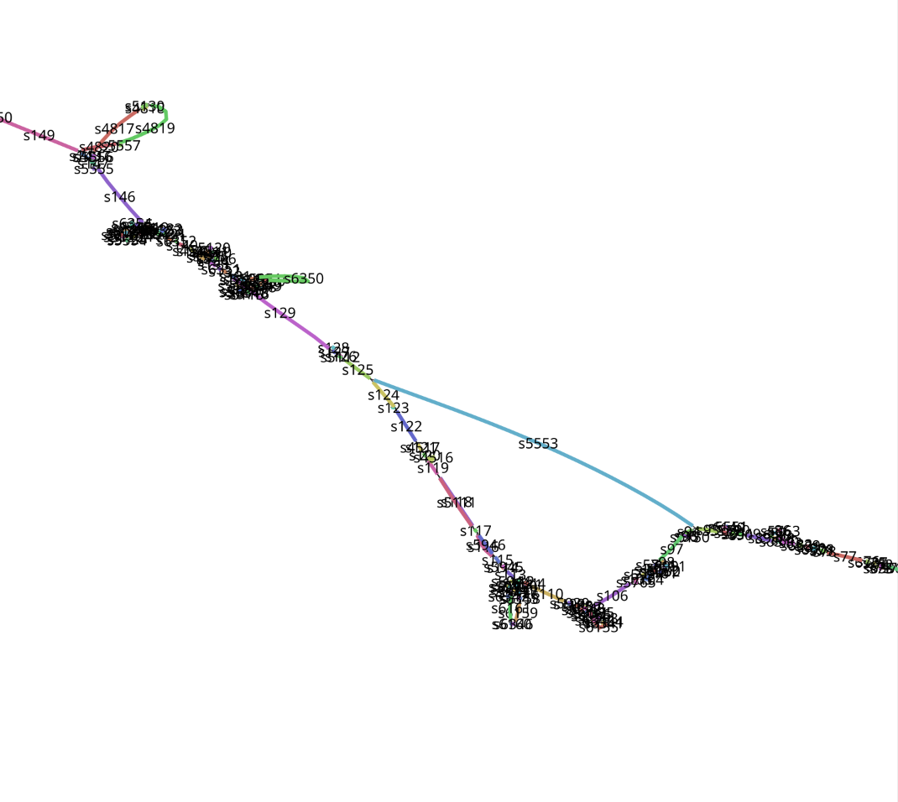
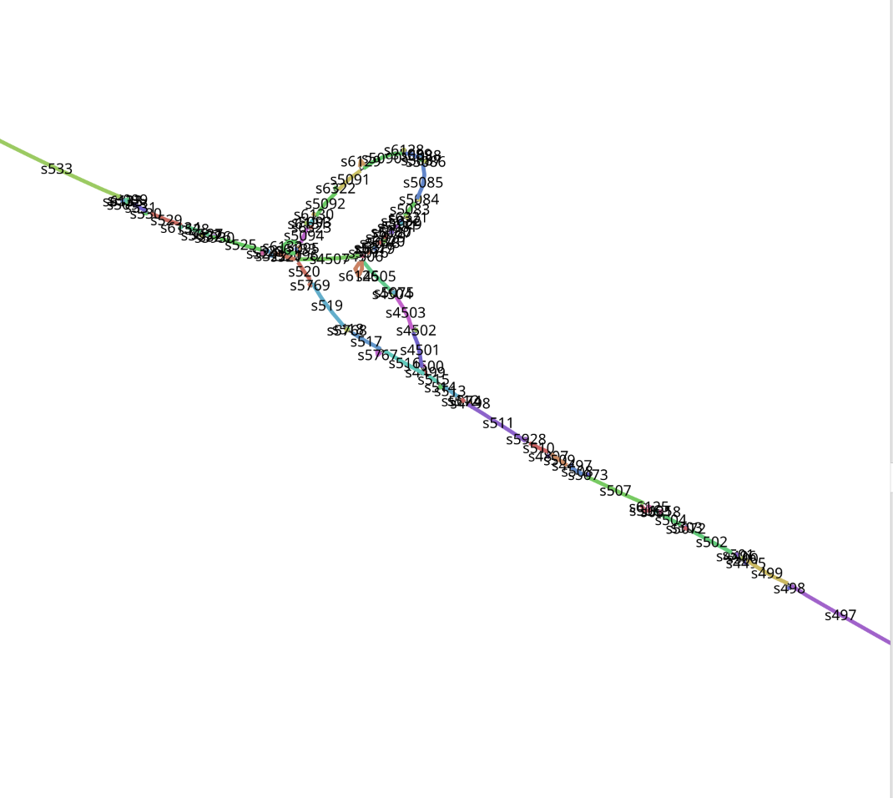
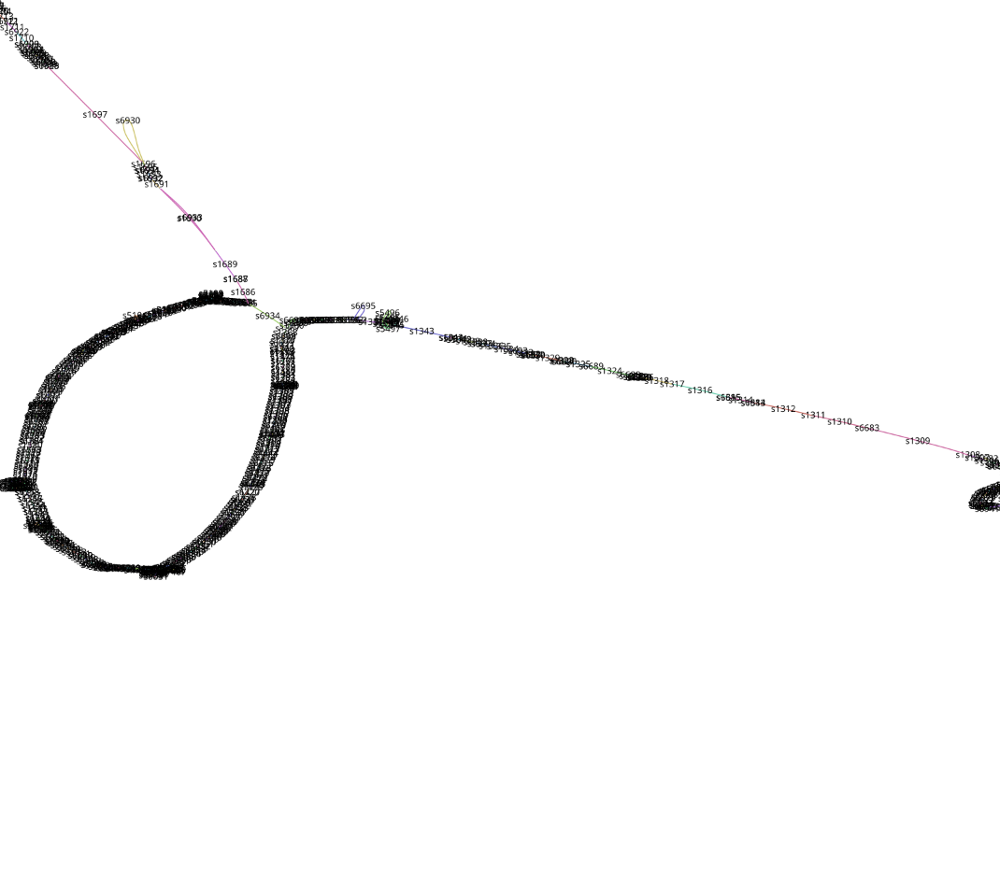
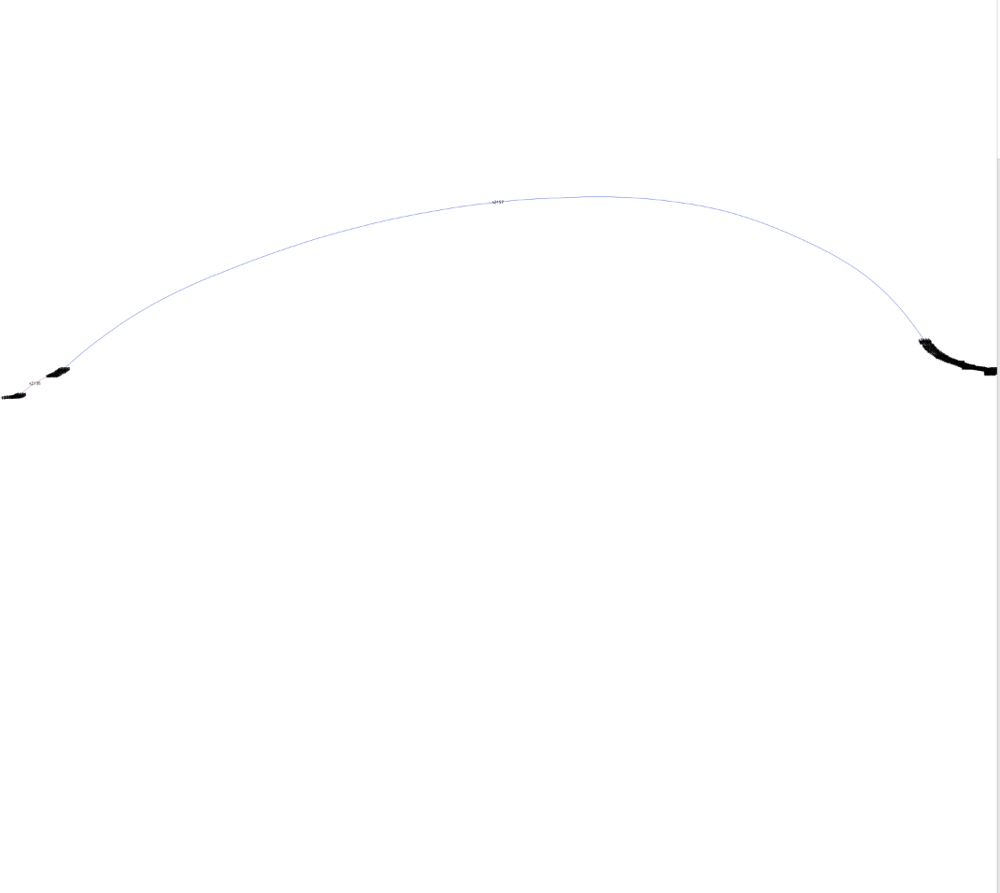
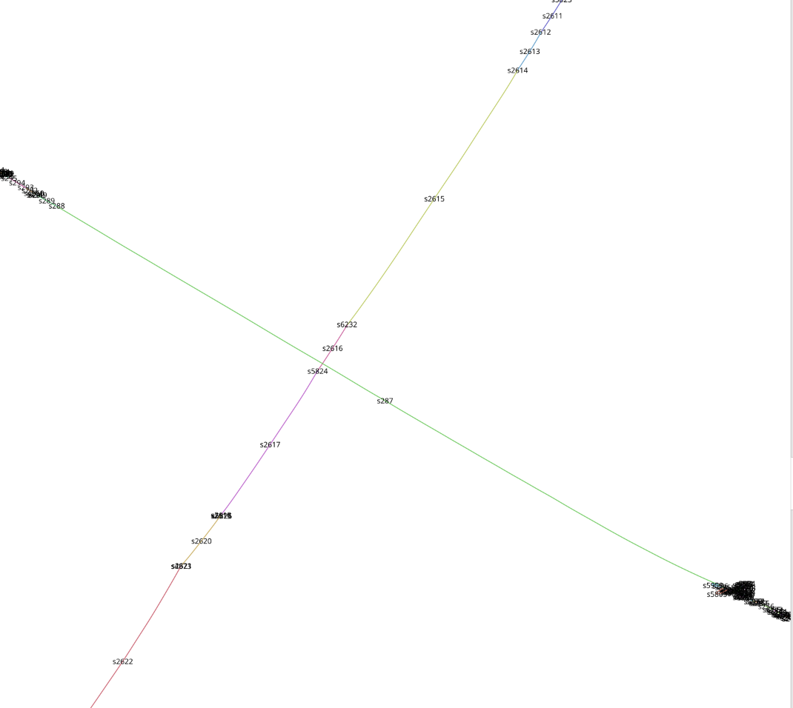
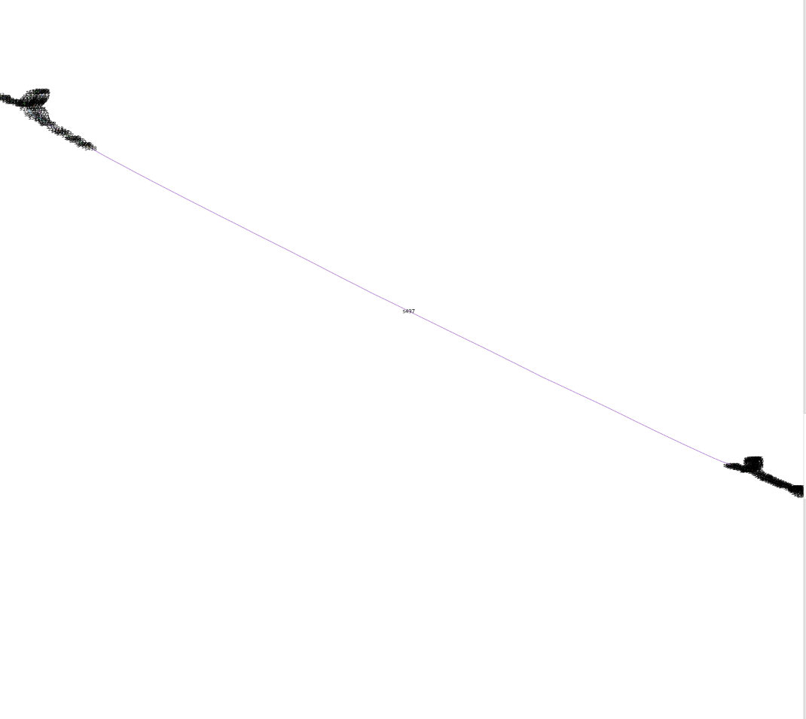

# Pangenome-Graphs *homo sapiens* chr21

## Introduction
- An project-centric reproducible pangenome-build pipeline using Docker and Snakemake, including illustrations of interesting regions (male, female) found via Bandage in chromosome 21 of 10 chromosomes in each sex
- I found highly structural variant regions but also long conserved regions
- I will not interpret the Biology, its only for demonstrational purposes, but I want to remark, that some structural variants looking interesting, and highlights the need of pangenome references

###### *Quick Note*
- Bandage outputs have different topologies every time, hence the graphs can vary when being reproduced !
- Graph build is computational expensive (taking increasingly longer with number of sequences), therefore I implemented the demo for a smaller subset (3 females, 3 males) then my initial run, hence the graphs look differently !
- *Demo*: 
    - ca. 70mb compressed, ca. 300mb uncompressed letters !
    - I excluded the path calling (single sample)

## Data
- *Homo sapiens* Chromosome 21 of B-Lymphocyte WGS (male and female)
- The exact IDs can be found in `configs/data.yml`

## Illustrations of Structural Variants in Chromosome 21
| Female Regions | Male regions |
|:---:|:---:|
|  |  |
|  |  |
|  |  |
|  |  |
|  |  |

*Fig. 1 illustrates the Bandage visualization of 4 regions of female (left) and 5 regions of male samples (right).*

## Pipeline
1. Downloading chr 21 of *homo sapiens* (males and females)
2. Build pangenome graphs onto each subset 
3. Further manual inspection of structural variants via Bandage

## Run Demo
- The script copies the relevant files into `__demo__` and saves the pipeline output there (mirroring my execution)
- Execute the `run_demo` binary (I set N_CORES=6, according to the cardinality of the subset):
```
# if you prefer podman
./scripts/run_demo.sh podman 6
```
```
# if you prefer docker 
./scripts/run_demo.sh docker 6 
```
- If you want to inspect the graphs you need to have `Bandage` installed and load a sample
- `file > load graph (.grf) > select male/female .grf > draw graph > node labels:name`

*quick note*

- I set a hard coded number for multithreading in the minigraph build ...
- `minigraph` also exports bed-like files which can be applied in downstream analysis
- `minigraph --call` outputs a reference to sample validation and takes sometime to compute,
  thats why I only included a demo for a single sample